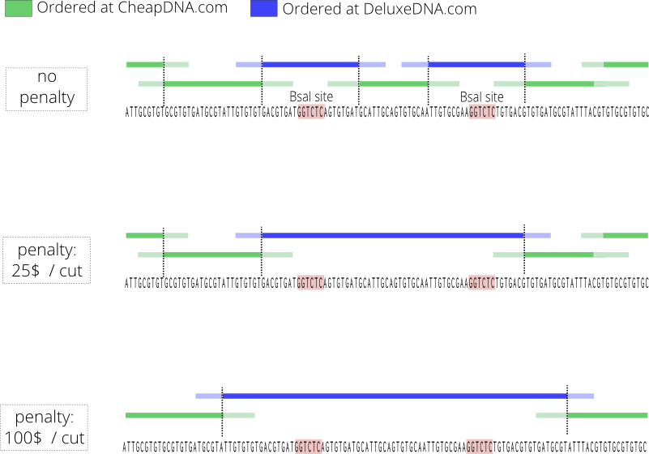

.. basic_example:

A basic example
---------------

We consider a random 5000bp DNA sequence that we wish to assemble using
Gibson Assembly on fragments with 40-basepairs overlaps.
The fragments can be ordered from to two different companies:

- Company *CheapDNA.com* charges 0.1$/bp for any sequence up to 4000bp without BsaI site.
- Company *DeluxeDNA.com* charges 0.2$/bp for any sequence up to 3000bp but there is no other constraint

As our sequence has 2 BsaI sites, some fragments will have to be ordered to
*DeluxeDNA.com*, but they should be as short as possible as they are more expensive.
The obvious solution is to order just the fragments around BsaI to *DeluxeDNA.com* and
all the rest to *CheapDNA.com*

This example shows that DnaWeaver will come to that solution. You can also use this
example to play around with the `cuts_number_penalty` parameter, which has for effect to
yield solutions with less fragments to order (but a higher total price).

Code
~~~~

.. literalinclude:: ../../examples/basic_example.py
