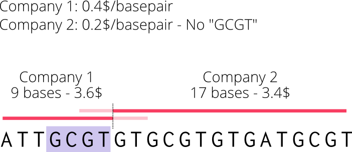
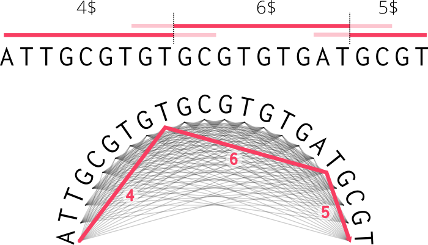

.. _howitworks:

How DNA Advisor works
----------------------

Graph representation of the problem
~~~~~~~~~~~~~~~~~~~~~~~~~~~~~~~~~~~

Long DNA sequences have a huge space of possible mutations
(just 20 nucleotides can form a trillion different sequences), therefore it is not
possible to solve a DNA optimization problem through an exhaustive search.
DnaAdvisor uses the following strategies to avoid exploring the whole search space:

Long DNA sequences have a huge space of possible mutations
(just 20 nucleotides can form a trillion different sequences), therefore it is not
possible to solve a DNA optimization problem through an exhaustive search.
DnaAdvisor uses the following strategies to avoid exploring the whole search space:

Cuts refinement
~~~~~~~~~~~~~~~

Long DNA sequences have a huge space of possible mutations
(just 20 nucleotides can form a trillion different sequences), therefore it is not
possible to solve a DNA optimization problem through an exhaustive search.
DnaAdvisor uses the following strategies to avoid exploring the whole search space:
using again the graph trick. The graph of a cuts refinement problem looks like this:

.. figure:: images/refinement.png
   :figwidth: 60%
   :align: center
